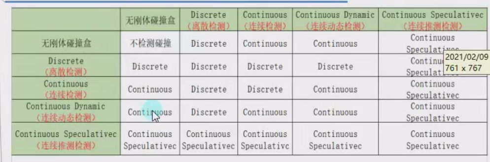

# 1.生命周期函数

## 1.生命周期函数的概念

​		-----所有继承MonoBehavior的脚本 最终都会挂载到Gameobject游戏对象上

生命周期函数 就是该脚本对象依附的Gameobject对象从出生到消亡整个生命周期中会通过==反射==自动调用的一些特殊函数

​	unity帮助我们记录了一个Gameobject对象依附了哪些脚本。会自动的得到这些对象，通过反射去执行一些固定名字的函数

## 2.生命周期函数访问修饰符一般为private和protected 

因为不需要再外部自己调用生命周期函数 都是unity自己帮助我们调用的 

## 3.生命周期函数支持继承多态 

# 2.可编辑变量

# 1.预制体

## 1 修改预制体（添加）

原有预制体添加一个对象进去

  

保存这种修改：

1.

2.直接拖入项目窗口原位置覆盖

## 2.修改预制体（删除）

打开预制体然后删除

## 3.新建预制体

先解压缩在修改保存

# 2.Camera可编辑参数

## 1.清除标志(Clear Flags)

天空盒渲染         ----3D

纯色渲染      ---2D

仅深度     ----多个摄像机叠加渲染

不清除      ------覆盖渲染，不清除上一帧的渲染   基本不用

## 2.剔除遮罩(Culling Mask)

选中会渲染哪些层       ----如果不选中该图层摄像机就不会渲染该图层

## 3.透视(Projection)

### 1.透视   ---近大远小   一般3D

### 2.正交    -----没有近大远小  一般2D

## 4.深度(Depth)

深度是渲染顺序上的深度    越小越先被渲染    后渲染的画面会遮挡前面渲染的画面

一般上层的相机选择 仅深度的清除标志，且深度较高    

## 5.目标纹理(Target Texture)

制作小地图   可以用一个新的摄像机来获取目标纹理

## 6.遮挡剔除(Occlusion culling)

## 7.Viewport 矩阵

可以用于双人游戏 		显示两个摄像机的画面

# 3.光源

## 1.面板参数

### 1.类型(Type)   

点光源   方向光    聚光灯   区域(仅用于烘焙)

## 2.模式(Mode)

实时  混合  已烘焙

## 3.光源亮度(Intensity)

## 4.阴影类型(Shadow Type)

无阴影(NoShadow)  

硬阴影 (HardShadow)   ----画质不好的阴影  锯齿

软阴影(SoftShadow)      ----柔和

## 5.绘制光晕(Draw Halo)

球形光源开关

## 6.炫光(Flare)

需要添加Flare Layer才可以在游戏窗口看见炫光

##  7.剔除遮罩

决定哪些层受光照影响

# 碰撞

碰撞检测

# 物理材质

# 音频

## 音频文件

后台加载

## audio source 

audio clip  ------音频源

唤醒时播放   -----一般只有背景音乐设置为唤醒时播放     

优先级 ----Unity中AudioSource的优先级用于在资源受限时决定哪些声音应优先播放，数值越低优先级越高。 

空间混响----------音频受3D影响   受近大远小影响吗

音量衰减  ----  三种衰减方式   